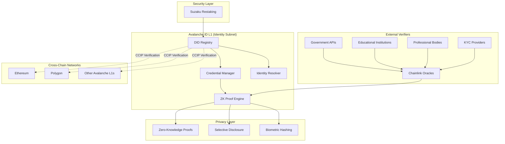

# 🆔 Avalanche ID

**Self-Sovereign Identity Infrastructure on Avalanche**

> *Empowering users with secure, private, and interoperable digital identity across blockchain networks*

[]() 
[]() 
[]()
[]()

## 🎯 Problem Statement

Digital identity management faces critical challenges in the Web3 ecosystem:

- **❌ Fragmented Identity**: Users manage multiple identities across different platforms and blockchains
- **❌ Privacy Concerns**: Centralized systems expose sensitive personal data to breaches and misuse
- **❌ Lack of Interoperability**: Identity credentials don't work across different blockchain networks
- **❌ Verification Bottlenecks**: No standardized way to verify credentials across ecosystems
- **❌ User Control**: Limited self-sovereignty over personal identity and credential management

## 💡 Solution Overview

**Avalanche ID** creates a comprehensive self-sovereign identity platform that enables:

✅ **Decentralized Identity**: W3C DID-compliant identities stored on Avalanche subnets  
✅ **Verifiable Credentials**: Cryptographically secure, privacy-preserving credentials  
✅ **Cross-Chain Verification**: Identity verification across networks via Chainlink CCIP  
✅ **Zero-Knowledge Proofs**: Selective disclosure without revealing sensitive information  
✅ **Suzaku Security**: Infrastructure protected by restaking and validator networks  

## 🏗️ Architecture



## 🚀 Key Features

### 🔐 Self-Sovereign Identity
- **W3C DID Standard**: Fully compliant decentralized identifiers
- **User Control**: Complete ownership and control over identity data
- **Recovery Mechanisms**: Secure social recovery and backup systems
- **Multi-Device Support**: Seamless identity access across devices

### 📜 Verifiable Credentials
- **Digital Certificates**: Tamper-proof academic, professional, and personal credentials
- **Issuer Network**: Trusted ecosystem of credential issuers and verifiers
- **Credential Templates**: Pre-built templates for common credential types
- **Expiration Management**: Automated handling of time-sensitive credentials

### 🔒 Privacy-Preserving Verification
- **Zero-Knowledge Proofs**: Prove identity attributes without revealing data
- **Selective Disclosure**: Share only necessary information for verification
- **Biometric Privacy**: Secure biometric verification without storing biometric data
- **Anonymous Credentials**: Verify qualifications without revealing identity

### 🌉 Cross-Chain Interoperability
- **Universal Verification**: Identity verification across all CCIP-supported networks
- **Credential Portability**: Use credentials in any Web3 application
- **Multi-Chain SSO**: Single sign-on across different blockchain ecosystems
- **Bridge Integration**: Seamless identity verification for cross-chain DeFi

### 🛡️ Enterprise Security
- **Suzaku-Secured Infrastructure**: Identity subnet protected by restaking
- **Cryptographic Standards**: Industry-standard encryption and digital signatures
- **Audit Trail**: Complete transparency with privacy preservation
- **Compliance Ready**: Built for regulatory compliance (GDPR, CCPA, etc.)

## 🎯 Hackathon Focus Areas

### Summit LONDON Avalanche Hackathon Alignment

| Track | Implementation | Prize Potential |
|-------|---------------|-----------------|
| **dApps on Avalanche L1s** | Custom identity subnet | Core track |
| **Cross-Chain dApps** | CCIP identity verification | Core track |
| **Tooling & Infrastructure** | Identity SDK and APIs | Core track |
| **AI Infra & Agents** | AI-powered identity verification | Core track |
| **Chainlink: Best usage of CCIP** | Cross-chain identity verification | **£6,000 GBP** |
| **Suzaku: Secure your L1** | Identity subnet security | **$5,000 SUZ** |

**Total Prize Potential: £6,000 + $5,000 SUZ + Main hackathon prizes**

## 🛠️ Technical Stack

### Blockchain Infrastructure
- **Avalanche Subnet**: Custom L1 for identity management
- **Solidity**: Smart contracts for DID registry and credential management
- **Chainlink CCIP**: Cross-chain identity verification
- **Chainlink Oracles**: External credential verification

### Identity Standards
- **W3C DID**: Decentralized identifier specification
- **W3C VC**: Verifiable credentials data model
- **JSON-LD**: Linked data format for credentials
- **BBS+ Signatures**: Privacy-preserving digital signatures

### Privacy Technology
- **Zero-Knowledge Proofs**: zk-SNARKs for selective disclosure
- **Merkle Trees**: Efficient credential verification
- **Homomorphic Encryption**: Privacy-preserving computations
- **Secure Multi-Party Computation**: Distributed verification

### Development Tools
- **Hardhat**: Smart contract development and testing
- **DID SDK**: Identity management library
- **React**: Frontend application framework
- **IPFS**: Decentralized storage for credential schemas

## 📋 Implementation Roadmap

### 🏃‍♂️ 2-Day Hackathon MVP

**Day 1 (Friday 2:30 PM - End of Day)**
- [ ] Deploy identity subnet on Avalanche Fuji
- [ ] Implement basic DID registry contract
- [ ] Set up Chainlink oracle integration
- [ ] Create simple credential issuance system

**Day 2 (Saturday)**
- [ ] Integrate Chainlink CCIP for cross-chain verification
- [ ] Implement basic zero-knowledge proof system
- [ ] Build demo frontend interface
- [ ] Create credential verification on destination chain
- [ ] Prepare presentation and demo

### 🎯 MVP Demonstration
- **Identity Type**: Professional Developer Identity
- **Credentials**: GitHub verification, Educational degree, Professional certification
- **Cross-Chain Demo**: Verify identity on Avalanche → Use for DeFi on Ethereum
- **Privacy Feature**: Prove age without revealing birthdate using ZK proofs

## 🚦 Getting Started

### Prerequisites
```bash
# Required tools
node >= 16.0.0
npm >= 8.0.0
git
foundry (for smart contract development)
```

### Quick Setup
```bash
# Clone and setup
git clone <repository-url>
cd avalanche_id
npm install

# Configure environment
cp env.example .env
# Add your RPC URLs, private keys, and API keys

# Deploy to Fuji testnet
npm run deploy:fuji

# Run tests
npm run test

# Start frontend
npm run dev
```

## 📁 Project Structure

```
avalanche_id/
├── contracts/              # Smart contracts
│   ├── DIDRegistry.sol
│   ├── CredentialManager.sol
│   ├── ZKVerifier.sol
│   └── CCIPGateway.sol
├── scripts/                # Deployment scripts
├── frontend/               # React application
├── zkp/                    # Zero-knowledge proof circuits
├── docs/                   # Additional documentation
├── test/                   # Contract tests
└── schemas/               # Credential schemas
```

## 🎮 Demo Scenarios

### Scenario 1: Developer Identity Verification
1. **Create Identity**: Developer creates DID on Avalanche ID
2. **Issue Credentials**: GitHub and LinkedIn verify professional credentials
3. **Cross-Chain DeFi**: Use verified identity to access premium DeFi features on Ethereum
4. **Privacy Preservation**: Prove experience level without revealing specific details

### Scenario 2: Educational Credential Verification
1. **Issue Degree**: University issues verifiable degree credential
2. **Job Application**: Graduate proves education to employer using ZK proofs
3. **Cross-Border Recognition**: Credential recognized across different jurisdictions
4. **Selective Disclosure**: Share degree field without revealing GPA or specific courses

### Scenario 3: Age Verification for DeFi
1. **KYC Integration**: Age verification through trusted KYC provider
2. **ZK Age Proof**: Generate proof of being over 18 without revealing exact age
3. **DeFi Access**: Access age-restricted DeFi protocols across multiple chains
4. **Privacy Protection**: No personal data stored or transmitted

## 💼 Business Value

### For Individuals
- **Self-Sovereignty**: Complete control over personal identity and data
- **Privacy Protection**: Share only necessary information
- **Universal Access**: Use identity across all Web3 applications
- **Cost Savings**: Eliminate redundant verification processes

### For Organizations
- **Compliance**: Meet regulatory requirements with verifiable audit trails
- **Cost Reduction**: Automated verification reduces manual processes
- **Fraud Prevention**: Cryptographically secure credentials prevent fraud
- **User Experience**: Simplified onboarding and verification

### For Developers
- **Easy Integration**: SDK for rapid identity integration
- **Cross-Chain Support**: Build applications that work across all networks
- **Privacy-First**: Built-in privacy protection for user data
- **Standardized**: W3C compliance ensures interoperability

## 🏆 Competitive Advantages

1. **First Avalanche-Native Identity**: Purpose-built for Avalanche ecosystem
2. **True Interoperability**: Works across all CCIP-supported networks
3. **Privacy by Design**: Zero-knowledge proofs built into core architecture
4. **Enterprise Ready**: Suzaku security and compliance features
5. **Developer Friendly**: Comprehensive SDK and documentation
6. **Standards Compliant**: Full W3C DID and VC compatibility

## 👥 Team Recommendations

**Ideal Team Composition (3-4 people):**
- **Identity/Cryptography Expert**: DID standards, ZK proofs, cryptography
- **Smart Contract Developer**: Solidity, Avalanche, Chainlink experience
- **Frontend Developer**: React, Web3, identity UX/UI
- **Product/Integration**: API design, demo preparation, presentation

## 📞 Support & Resources

### Official Documentation
- [W3C DID Specification](https://www.w3.org/TR/did-core/)
- [W3C Verifiable Credentials](https://www.w3.org/TR/vc-data-model/)
- [Avalanche Subnet Documentation](https://docs.avax.network/subnets)
- [Chainlink CCIP Guide](https://docs.chain.link/ccip)

### Development Resources
- [DID Method Registry](https://w3c.github.io/did-spec-registries/)
- [Verifiable Credentials Implementation Guide](https://w3c.github.io/vc-imp-guide/)
- [CCIP Starter Kit](https://github.com/smartcontractkit/ccip-starter-kit-foundry)
- [Suzaku Documentation](https://docs.suzaku.network)

### Identity Libraries
- [did-jwt](https://github.com/decentralized-identity/did-jwt)
- [veramo](https://github.com/uport-project/veramo)
- [circomlib](https://github.com/iden3/circomlib) (for ZK circuits)

---

## 📄 Additional Documentation

- [Technical Specification](./docs/TECHNICAL_SPECIFICATION.md)
- [Architecture Deep Dive](./docs/ARCHITECTURE.md)
- [Implementation Plan](./docs/IMPLEMENTATION_PLAN.md)
- [Security Considerations](./docs/SECURITY.md)
- [API Documentation](./docs/API_DOCUMENTATION.md)

---

## 🌟 Use Cases

### Web3 Applications
- **DeFi KYC**: Prove eligibility for regulated DeFi protocols
- **NFT Marketplace**: Verify creator identity and authenticity
- **Gaming**: Persistent identity across Web3 games
- **Social Media**: Verified profiles without doxxing

### Traditional Integration
- **Employment**: Verify credentials for remote work
- **Education**: Cross-border degree recognition
- **Healthcare**: Secure patient identity management
- **Government**: Digital citizen services

### Enterprise Solutions
- **Corporate Identity**: Employee credential management
- **Supply Chain**: Verify participant identities
- **Financial Services**: Enhanced due diligence
- **Real Estate**: Identity verification for transactions

---

**Built with ❤️ for Summit LONDON Avalanche Hackathon 2025**

*Empowering digital sovereignty, one identity at a time.* 