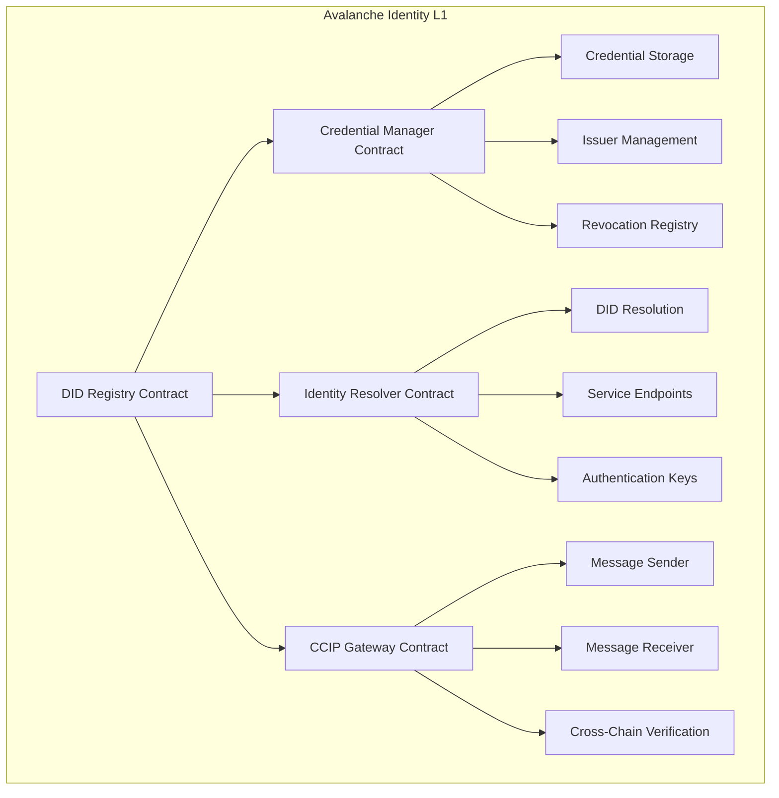
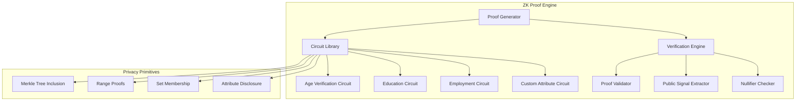
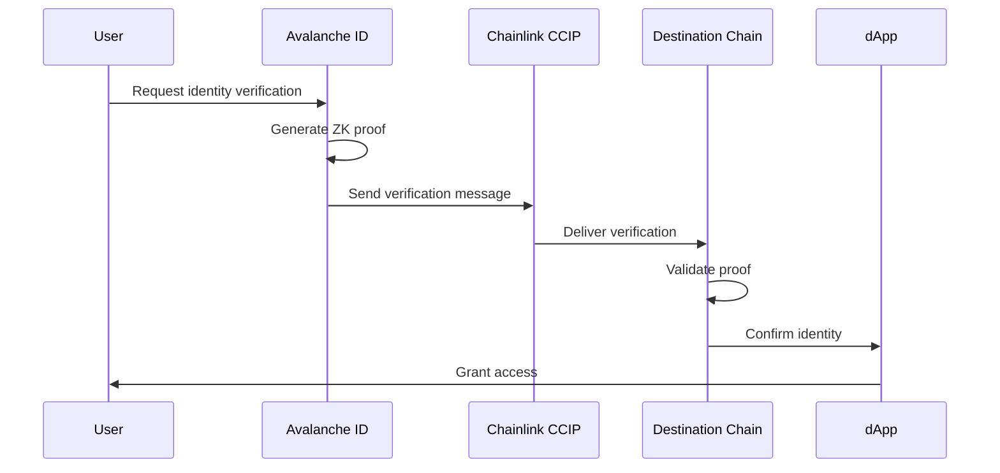
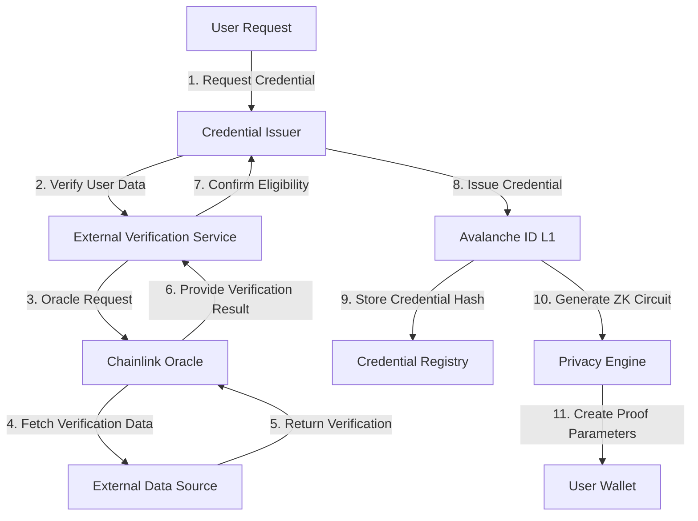
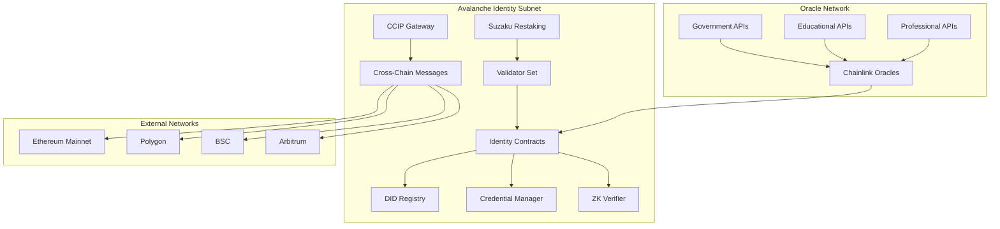
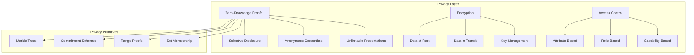
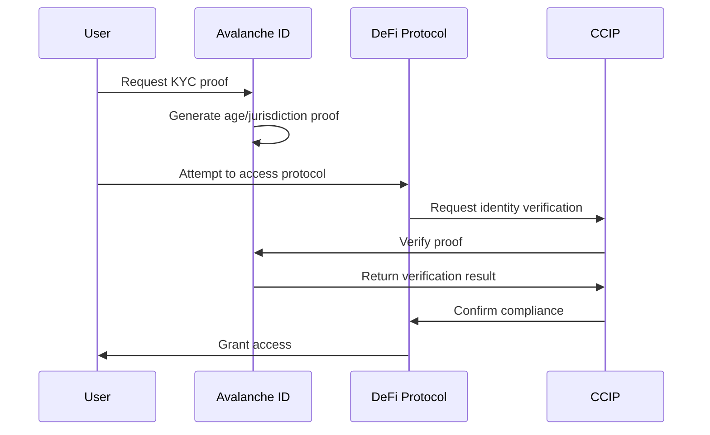
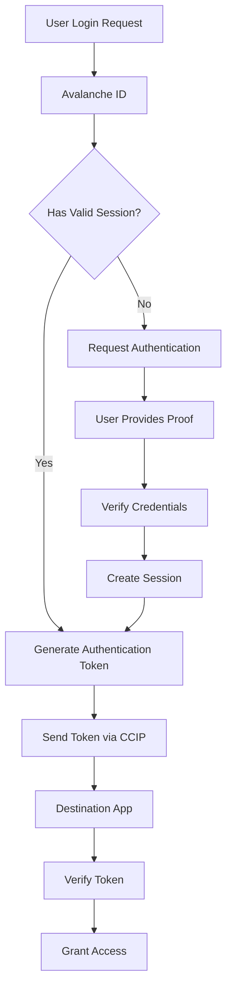

# 🏗️ Architecture Deep Dive

## System Overview

Avalanche ID is built on a **three-layer architecture** optimized for decentralized identity management:

1. **Identity Layer**: Custom Avalanche L1 for DID registry and credential management
2. **Verification Layer**: Chainlink oracles and CCIP for cross-chain verification
3. **Privacy Layer**: Zero-knowledge proofs and selective disclosure mechanisms

## 🎯 Core Components

### 1. Avalanche Identity L1 (Custom Subnet)



#### DID Registry Contract
**Purpose**: Core registry for decentralized identifiers
**Key Functions**:
- `createDID(publicKey, serviceEndpoints)`: Register new DID
- `updateDIDDocument(did, newDocument, proof)`: Update DID document
- `resolveDID(did)`: Retrieve DID document
- `deactivateDID(did, proof)`: Deactivate DID

#### Credential Manager Contract
**Purpose**: Manage verifiable credentials lifecycle
**Key Functions**:
- `issueCredential(issuerDID, subjectDID, credentialData, proof)`: Issue new credential
- `verifyCredential(credentialHash, proofs)`: Verify credential authenticity
- `revokeCredential(credentialId, reason, proof)`: Revoke credential
- `getCredentialStatus(credentialId)`: Check credential status

#### Identity Resolver Contract
**Purpose**: Resolve DIDs to their documents and services
**Key Functions**:
- `resolve(did)`: Return DID document
- `getPublicKey(did, keyId)`: Retrieve specific public key
- `getServiceEndpoint(did, serviceType)`: Get service endpoint
- `verifySignature(did, message, signature)`: Verify signature against DID

### 2. Zero-Knowledge Proof Engine



#### Proof Circuit Types
1. **Age Verification**: Prove age range without revealing exact age
2. **Education Verification**: Prove degree completion without revealing institution
3. **Employment Verification**: Prove employment status without revealing employer
4. **Attribute Verification**: Prove possession of attributes without revealing values

### 3. Cross-Chain Verification (Chainlink CCIP)



#### CCIP Message Structure
```solidity
struct IdentityVerificationMessage {
    string did;
    bytes32 proofHash;
    uint256[] publicSignals;
    bytes zkProof;
    string[] verifiedAttributes;
    uint256 timestamp;
    uint256 expirationTime;
    bytes signature;
}
```

### 4. Credential Issuance Flow



## 📊 Data Models

### DID Document Structure
```json
{
  "@context": [
    "https://www.w3.org/ns/did/v1",
    "https://w3id.org/security/v1"
  ],
  "id": "did:avalanche:0x1234567890abcdef",
  "authentication": [
    {
      "id": "did:avalanche:0x1234567890abcdef#key-1",
      "type": "EcdsaSecp256k1VerificationKey2019",
      "controller": "did:avalanche:0x1234567890abcdef",
      "publicKeyHex": "0x..."
    }
  ],
  "assertionMethod": ["did:avalanche:0x1234567890abcdef#key-1"],
  "keyAgreement": [
    {
      "id": "did:avalanche:0x1234567890abcdef#key-2",
      "type": "X25519KeyAgreementKey2019",
      "controller": "did:avalanche:0x1234567890abcdef",
      "publicKeyBase58": "..."
    }
  ],
  "service": [
    {
      "id": "did:avalanche:0x1234567890abcdef#identity-hub",
      "type": "IdentityHub",
      "serviceEndpoint": "https://identity.avalanche.id/hub"
    }
  ],
  "credentialRegistry": "0xCredentialRegistryAddress",
  "created": "2025-05-23T10:30:00Z",
  "updated": "2025-05-23T10:30:00Z"
}
```

### Verifiable Credential Structure
```json
{
  "@context": [
    "https://www.w3.org/2018/credentials/v1",
    "https://avalanche.id/contexts/v1"
  ],
  "id": "https://avalanche.id/credentials/12345",
  "type": ["VerifiableCredential", "EducationCredential"],
  "issuer": {
    "id": "did:avalanche:university",
    "name": "University of Technology"
  },
  "issuanceDate": "2025-05-23T10:30:00Z",
  "expirationDate": "2030-05-23T10:30:00Z",
  "credentialSubject": {
    "id": "did:avalanche:0x1234567890abcdef",
    "degree": {
      "type": "Bachelor of Science",
      "field": "Computer Science",
      "institution": "University of Technology",
      "graduationYear": 2024
    }
  },
  "proof": {
    "type": "BbsBlsSignature2020",
    "created": "2025-05-23T10:30:00Z",
    "proofPurpose": "assertionMethod",
    "verificationMethod": "did:avalanche:university#key-1",
    "signature": "..."
  },
  "credentialSchema": {
    "id": "https://avalanche.id/schemas/education/v1",
    "type": "JsonSchemaValidator2018"
  },
  "zkCircuit": {
    "circuitId": "education_degree_v1",
    "wasmUrl": "https://circuits.avalanche.id/education_degree.wasm",
    "zkeyUrl": "https://circuits.avalanche.id/education_degree.zkey"
  }
}
```

## 🔧 Technical Specifications

### Smart Contract Architecture

#### DIDRegistry.sol
```solidity
contract DIDRegistry is Ownable, ReentrancyGuard {
    struct DIDDocument {
        string id;
        bytes32 documentHash;
        address controller;
        uint256 created;
        uint256 updated;
        bool active;
        string[] contexts;
        PublicKey[] publicKeys;
        Service[] services;
    }
    
    struct PublicKey {
        string id;
        string keyType;
        address controller;
        bytes publicKeyData;
    }
    
    struct Service {
        string id;
        string serviceType;
        string serviceEndpoint;
    }
    
    mapping(string => DIDDocument) public didDocuments;
    mapping(address => string[]) public controllerToDIDs;
    mapping(bytes32 => bool) public documentHashes;
    
    event DIDCreated(string indexed did, address indexed controller);
    event DIDUpdated(string indexed did, bytes32 newDocumentHash);
    event DIDDeactivated(string indexed did);
    
    function createDID(
        string memory did,
        bytes32 documentHash,
        PublicKey[] memory publicKeys,
        Service[] memory services
    ) external nonReentrant returns (bool) {
        require(bytes(didDocuments[did].id).length == 0, "DID already exists");
        require(!documentHashes[documentHash], "Document hash already used");
        
        DIDDocument storage doc = didDocuments[did];
        doc.id = did;
        doc.documentHash = documentHash;
        doc.controller = msg.sender;
        doc.created = block.timestamp;
        doc.updated = block.timestamp;
        doc.active = true;
        
        // Store public keys and services
        for (uint i = 0; i < publicKeys.length; i++) {
            doc.publicKeys.push(publicKeys[i]);
        }
        
        for (uint i = 0; i < services.length; i++) {
            doc.services.push(services[i]);
        }
        
        controllerToDIDs[msg.sender].push(did);
        documentHashes[documentHash] = true;
        
        emit DIDCreated(did, msg.sender);
        return true;
    }
}
```

#### CredentialManager.sol
```solidity
contract CredentialManager is Ownable, ReentrancyGuard {
    struct Credential {
        bytes32 id;
        string issuerDID;
        string subjectDID;
        bytes32 credentialHash;
        bytes32 schemaHash;
        uint256 issuanceDate;
        uint256 expirationDate;
        bool active;
        CredentialStatus status;
    }
    
    enum CredentialStatus {
        ACTIVE,
        REVOKED,
        SUSPENDED,
        EXPIRED
    }
    
    mapping(bytes32 => Credential) public credentials;
    mapping(string => bool) public authorizedIssuers;
    mapping(bytes32 => string) public revocationReasons;
    mapping(string => bytes32[]) public subjectCredentials;
    
    event CredentialIssued(
        bytes32 indexed credentialId,
        string indexed issuerDID,
        string indexed subjectDID
    );
    
    event CredentialRevoked(
        bytes32 indexed credentialId,
        string reason
    );
    
    function issueCredential(
        bytes32 credentialId,
        string memory issuerDID,
        string memory subjectDID,
        bytes32 credentialHash,
        bytes32 schemaHash,
        uint256 expirationDate,
        bytes memory issuerSignature
    ) external nonReentrant returns (bool) {
        require(authorizedIssuers[issuerDID], "Unauthorized issuer");
        require(credentials[credentialId].issuanceDate == 0, "Credential already exists");
        require(expirationDate > block.timestamp, "Invalid expiration date");
        
        // Verify issuer signature
        require(_verifyIssuerSignature(
            credentialId,
            issuerDID,
            subjectDID,
            credentialHash,
            issuerSignature
        ), "Invalid issuer signature");
        
        credentials[credentialId] = Credential({
            id: credentialId,
            issuerDID: issuerDID,
            subjectDID: subjectDID,
            credentialHash: credentialHash,
            schemaHash: schemaHash,
            issuanceDate: block.timestamp,
            expirationDate: expirationDate,
            active: true,
            status: CredentialStatus.ACTIVE
        });
        
        subjectCredentials[subjectDID].push(credentialId);
        
        emit CredentialIssued(credentialId, issuerDID, subjectDID);
        return true;
    }
    
    function verifyCredential(
        bytes32 credentialId,
        bytes memory proof
    ) external view returns (bool isValid, CredentialStatus status) {
        Credential memory cred = credentials[credentialId];
        
        if (cred.issuanceDate == 0) {
            return (false, CredentialStatus.REVOKED);
        }
        
        if (block.timestamp > cred.expirationDate) {
            return (false, CredentialStatus.EXPIRED);
        }
        
        if (!cred.active) {
            return (false, cred.status);
        }
        
        // Additional proof verification logic would go here
        return (true, CredentialStatus.ACTIVE);
    }
}
```

### Zero-Knowledge Proof Circuits

#### Age Verification Circuit (Circom)
```javascript
pragma circom 2.0.0;

template AgeVerification() {
    // Private inputs
    signal private input birthYear;
    signal private input birthMonth;
    signal private input birthDay;
    signal private input currentYear;
    signal private input currentMonth;
    signal private input currentDay;
    signal private input minAge;
    
    // Public inputs
    signal input credentialHash;
    
    // Output
    signal output isValid;
    
    // Age calculation
    component ageCalc = CalculateAge();
    ageCalc.birthYear <== birthYear;
    ageCalc.birthMonth <== birthMonth;
    ageCalc.birthDay <== birthDay;
    ageCalc.currentYear <== currentYear;
    ageCalc.currentMonth <== currentMonth;
    ageCalc.currentDay <== currentDay;
    
    // Check if age >= minAge
    component geq = GreaterEqualThan(8);
    geq.in[0] <== ageCalc.age;
    geq.in[1] <== minAge;
    
    isValid <== geq.out;
    
    // Ensure the person is using their own credential
    component credCheck = CredentialOwnership();
    credCheck.credentialHash <== credentialHash;
    credCheck.birthYear <== birthYear;
    credCheck.birthMonth <== birthMonth;
    credCheck.birthDay <== birthDay;
    credCheck.out === 1;
}

template CalculateAge() {
    signal input birthYear;
    signal input birthMonth;
    signal input birthDay;
    signal input currentYear;
    signal input currentMonth;
    signal input currentDay;
    signal output age;
    
    // Simplified age calculation
    age <== currentYear - birthYear;
}

component main = AgeVerification();
```

## 🌐 Network Topology

### Identity Subnet Configuration


### Performance Specifications

| Component | Specification | Target Performance |
|-----------|---------------|-------------------|
| **DID Creation** | Time to register | < 10 seconds |
| **Credential Issuance** | Time to issue | < 30 seconds |
| **ZK Proof Generation** | Proof creation | < 5 seconds |
| **Cross-Chain Verification** | CCIP delivery | < 20 minutes |
| **Identity Resolution** | DID resolution | < 2 seconds |
| **Subnet Throughput** | TPS capacity | 4,500+ TPS |

### Privacy Architecture



## 🔄 Integration Patterns

### DeFi KYC Integration


### Cross-Chain SSO


## 📈 Scalability Design

### Horizontal Scaling
- **Subnet Federation**: Multiple identity subnets for different regions/domains
- **Sharded Credential Storage**: Distribute credentials across multiple contracts
- **Parallel Proof Generation**: Multi-threaded ZK proof computation

### Vertical Scaling  
- **Optimized Circuits**: Minimize constraint count in ZK circuits
- **Batch Operations**: Process multiple credentials in single transaction
- **State Compression**: Use Merkle trees for efficient storage

### Future Enhancements
- **Recursive Proofs**: Enable proof composition for complex scenarios
- **Quantum-Resistant Cryptography**: Prepare for post-quantum security
- **AI-Enhanced Verification**: Machine learning for fraud detection

---

*This architecture supports both the 2-day hackathon implementation and provides a foundation for enterprise-scale identity management across the Web3 ecosystem.* 