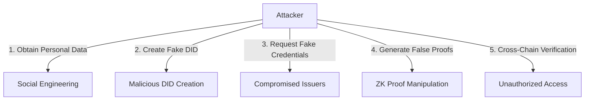
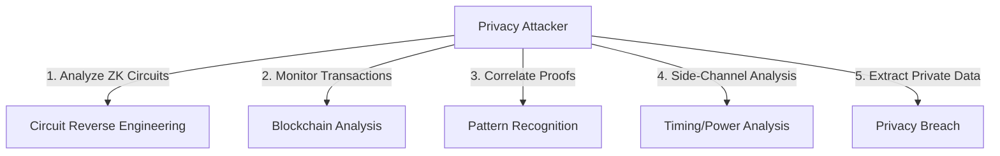
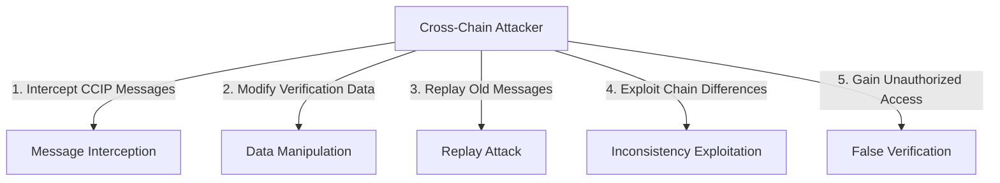
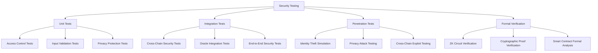

# 🔒 Security Considerations

## Overview

Avalanche ID handles sensitive personal identity data and enables critical verification processes across multiple blockchain networks. This document outlines the comprehensive security model, threat analysis, privacy protections, and mitigation strategies implemented to ensure the highest levels of security and privacy for users' digital identities.

## 🎯 Security Objectives

### Primary Security Goals
1. **Identity Sovereignty**: Ensure users maintain complete control over their digital identities
2. **Privacy Protection**: Implement zero-knowledge proofs for privacy-preserving verification
3. **Data Integrity**: Prevent tampering with identity documents and credentials
4. **Cross-Chain Security**: Maintain security across different blockchain networks
5. **Credential Authenticity**: Verify the legitimacy of credential issuers and prevent forgery
6. **Access Control**: Implement granular permissions for identity operations

## 🚨 Threat Model

### Threat Actors

#### 1. Identity Thieves
**Capabilities**: Attempt to steal or impersonate others' identities
**Motivation**: Financial gain, access to restricted services
**Impact**: Critical - Complete identity compromise
**Attack Vectors**: Social engineering, credential stuffing, phishing

#### 2. Malicious Credential Issuers
**Capabilities**: Issue fraudulent or false credentials
**Motivation**: Profit from fake credentials, reputation damage
**Impact**: High - Undermines system trust and credential validity
**Attack Vectors**: Unauthorized issuer registration, credential forgery

#### 3. Privacy Attackers
**Capabilities**: Attempt to extract private information from ZK proofs
**Motivation**: Identity surveillance, data monetization
**Impact**: High - Privacy violation and personal data exposure
**Attack Vectors**: Circuit analysis, side-channel attacks, correlation attacks

#### 4. Cross-Chain Exploiters
**Capabilities**: Manipulate cross-chain identity verification
**Motivation**: Access services without proper credentials
**Impact**: High - False identity verification across chains
**Attack Vectors**: CCIP message manipulation, replay attacks, chain reorganization

#### 5. Smart Contract Exploiters
**Capabilities**: Find and exploit contract vulnerabilities
**Motivation**: System disruption, unauthorized access
**Impact**: Critical - System compromise and data manipulation
**Attack Vectors**: Reentrancy, integer overflow, access control bypass

#### 6. Oracle Manipulators
**Capabilities**: Provide false external verification data
**Motivation**: Enable fraudulent credentials
**Impact**: High - Compromises external data integrity
**Attack Vectors**: Oracle collusion, data source manipulation

### Attack Scenarios

#### Identity Impersonation Attack


#### Privacy Violation Attack


#### Cross-Chain Manipulation


## 🛡️ Security Controls

### 1. Identity Protection

#### DID Security Implementation
```solidity
contract SecureDIDRegistry {
    // Rate limiting for DID operations
    mapping(address => uint256) public lastDIDOperation;
    uint256 public constant OPERATION_COOLDOWN = 1 hours;
    
    modifier rateLimited() {
        require(
            block.timestamp >= lastDIDOperation[msg.sender] + OPERATION_COOLDOWN,
            "Operation rate limited"
        );
        lastDIDOperation[msg.sender] = block.timestamp;
        _;
    }
    
    // Multi-signature requirement for critical operations
    mapping(string => mapping(address => bool)) public didApprovals;
    mapping(string => uint256) public requiredApprovals;
    
    function approveDIDOperation(string memory did, bytes32 operationHash) external {
        require(isAuthorizedApprover(did, msg.sender), "Not authorized approver");
        didApprovals[did][msg.sender] = true;
    }
    
    function executeDIDOperation(
        string memory did,
        bytes32 operationHash
    ) external returns (bool) {
        require(_hasRequiredApprovals(did, operationHash), "Insufficient approvals");
        // Execute operation
        return true;
    }
    
    // Biometric binding for enhanced security
    mapping(string => bytes32) public biometricHashes;
    
    function bindBiometric(
        string memory did,
        bytes32 biometricHash,
        bytes memory signature
    ) external onlyDIDController(did) {
        require(_verifyBiometricSignature(did, biometricHash, signature), "Invalid signature");
        biometricHashes[did] = biometricHash;
    }
}
```

#### Key Management Security
```solidity
contract SecureKeyManager {
    struct KeyMetadata {
        uint256 created;
        uint256 lastUsed;
        uint256 usageCount;
        bool compromised;
        bytes32 backupHash;
    }
    
    mapping(string => mapping(string => KeyMetadata)) public keyMetadata;
    
    // Key rotation enforcement
    uint256 public constant MAX_KEY_AGE = 365 days;
    uint256 public constant MAX_KEY_USAGE = 10000;
    
    function requireKeyRotation(string memory did, string memory keyId) external view returns (bool) {
        KeyMetadata memory metadata = keyMetadata[did][keyId];
        
        return (block.timestamp - metadata.created > MAX_KEY_AGE) ||
               (metadata.usageCount > MAX_KEY_USAGE) ||
               metadata.compromised;
    }
    
    // Secure key backup with threshold scheme
    mapping(string => mapping(uint256 => bytes32)) public keyBackupShares;
    mapping(string => uint256) public backupThreshold;
    
    function createKeyBackup(
        string memory did,
        string memory keyId,
        bytes32[] memory shares,
        uint256 threshold
    ) external onlyDIDController(did) {
        require(threshold <= shares.length, "Invalid threshold");
        require(threshold >= 2, "Minimum threshold is 2");
        
        for (uint256 i = 0; i < shares.length; i++) {
            keyBackupShares[did][i] = shares[i];
        }
        backupThreshold[did] = threshold;
    }
}
```

### 2. Privacy Protection

#### Zero-Knowledge Proof Security
```solidity
contract SecureZKVerifier {
    // Circuit integrity verification
    mapping(string => bytes32) public circuitHashes;
    mapping(string => address) public trustedSetupAuthorities;
    
    function registerCircuit(
        string memory circuitId,
        bytes32 circuitHash,
        address setupAuthority,
        bytes memory authoritySignature
    ) external onlyOwner {
        require(_verifySetupAuthority(setupAuthority, authoritySignature), "Invalid authority");
        
        circuitHashes[circuitId] = circuitHash;
        trustedSetupAuthorities[circuitId] = setupAuthority;
    }
    
    // Anti-correlation measures
    mapping(bytes32 => uint256) public proofUsageCount;
    uint256 public constant MAX_PROOF_REUSE = 5;
    
    function verifyProofFreshness(bytes32 proofHash) internal {
        require(proofUsageCount[proofHash] < MAX_PROOF_REUSE, "Proof overused");
        proofUsageCount[proofHash]++;
    }
    
    // Nullifier management for preventing double-spending
    mapping(bytes32 => bool) public usedNullifiers;
    mapping(bytes32 => uint256) public nullifierTimestamps;
    uint256 public constant NULLIFIER_VALIDITY_PERIOD = 7 days;
    
    function verifyNullifier(bytes32 nullifier) internal {
        require(!usedNullifiers[nullifier], "Nullifier already used");
        require(
            block.timestamp - nullifierTimestamps[nullifier] <= NULLIFIER_VALIDITY_PERIOD,
            "Nullifier expired"
        );
        
        usedNullifiers[nullifier] = true;
        nullifierTimestamps[nullifier] = block.timestamp;
    }
}
```

#### Privacy-Preserving Credential Verification
```javascript
// Enhanced age verification circuit with privacy features
pragma circom 2.0.0;

template PrivateAgeVerification() {
    // Private inputs (never revealed)
    signal private input birthYear;
    signal private input birthMonth;
    signal private input birthDay;
    signal private input credentialSecret;
    signal private input salt; // Random salt for unlinkability
    
    // Public inputs
    signal input minAge;
    signal input maxAge; // Age range verification
    signal input credentialCommitment;
    signal input verifierNonce; // Prevents proof reuse
    
    // Outputs
    signal output isValidAge;
    signal output ageRangeProof; // Proves age in range without revealing exact age
    signal output nullifier;
    
    // Calculate age
    component ageCalc = CalculateAge();
    ageCalc.birthYear <== birthYear;
    ageCalc.birthMonth <== birthMonth;
    ageCalc.birthDay <== birthDay;
    
    // Verify age is in valid range
    component minCheck = GreaterEqualThan(8);
    minCheck.in[0] <== ageCalc.age;
    minCheck.in[1] <== minAge;
    
    component maxCheck = LessEqualThan(8);
    maxCheck.in[0] <== ageCalc.age;
    maxCheck.in[1] <== maxAge;
    
    component rangeCheck = AND();
    rangeCheck.a <== minCheck.out;
    rangeCheck.b <== maxCheck.out;
    
    isValidAge <== rangeCheck.out;
    
    // Generate age range proof (e.g., 18-25, 26-35, etc.)
    component rangeProof = AgeRangeEncoder();
    rangeProof.age <== ageCalc.age;
    ageRangeProof <== rangeProof.out;
    
    // Verify credential commitment with salt
    component credVerify = Poseidon(5);
    credVerify.inputs[0] <== birthYear;
    credVerify.inputs[1] <== birthMonth;
    credVerify.inputs[2] <== birthDay;
    credVerify.inputs[3] <== credentialSecret;
    credVerify.inputs[4] <== salt;
    
    credVerify.out === credentialCommitment;
    
    // Generate unique nullifier with verifier nonce
    component nullifierCalc = Poseidon(3);
    nullifierCalc.inputs[0] <== credentialSecret;
    nullifierCalc.inputs[1] <== verifierNonce;
    nullifierCalc.inputs[2] <== salt;
    
    nullifier <== nullifierCalc.out;
}
```

### 3. Cross-Chain Security

#### Secure CCIP Implementation
```solidity
contract SecureCCIPGateway {
    // Message authentication and integrity
    mapping(bytes32 => bytes32) public messageHashes;
    mapping(bytes32 => uint256) public messageTimestamps;
    uint256 public constant MESSAGE_VALIDITY_PERIOD = 1 hours;
    
    function sendSecureIdentityVerification(
        uint64 destinationChain,
        address receiver,
        IdentityVerificationMessage memory message
    ) external returns (bytes32 messageId) {
        // Generate message integrity hash
        bytes32 messageHash = keccak256(abi.encode(
            message.did,
            message.proofHash,
            message.timestamp,
            block.chainid,
            destinationChain
        ));
        
        // Sign message hash
        bytes32 signedHash = keccak256(abi.encodePacked(
            "\x19Ethereum Signed Message:\n32",
            messageHash
        ));
        
        message.signature = _signMessage(signedHash);
        message.integrityHash = messageHash;
        
        // Send with additional security metadata
        messageId = _sendCCIPMessage(destinationChain, receiver, message);
        
        messageHashes[messageId] = messageHash;
        messageTimestamps[messageId] = block.timestamp;
        
        return messageId;
    }
    
    function _ccipReceive(Client.Any2EVMMessage memory any2EvmMessage) internal override {
        IdentityVerificationMessage memory message = abi.decode(
            any2EvmMessage.data,
            (IdentityVerificationMessage)
        );
        
        // Verify message timing
        require(
            block.timestamp <= message.timestamp + MESSAGE_VALIDITY_PERIOD,
            "Message expired"
        );
        
        // Verify message integrity
        bytes32 expectedHash = keccak256(abi.encode(
            message.did,
            message.proofHash,
            message.timestamp,
            any2EvmMessage.sourceChainSelector,
            _getChainSelector()
        ));
        
        require(expectedHash == message.integrityHash, "Message integrity check failed");
        
        // Verify signature
        require(_verifyMessageSignature(message), "Invalid signature");
        
        // Additional verification logic...
        _processVerifiedMessage(any2EvmMessage.messageId, message);
    }
    
    // Rate limiting for cross-chain messages
    mapping(address => uint256) public lastMessageTime;
    mapping(address => uint256) public messageCount;
    uint256 public constant MESSAGE_RATE_LIMIT = 10; // per hour
    
    modifier messagingRateLimit() {
        uint256 timePassed = block.timestamp - lastMessageTime[msg.sender];
        if (timePassed >= 1 hours) {
            messageCount[msg.sender] = 0;
            lastMessageTime[msg.sender] = block.timestamp;
        }
        
        require(messageCount[msg.sender] < MESSAGE_RATE_LIMIT, "Message rate limit exceeded");
        messageCount[msg.sender]++;
        _;
    }
}
```

### 4. Credential Security

#### Secure Credential Issuance
```solidity
contract SecureCredentialManager {
    // Credential validation pipeline
    struct ValidationPipeline {
        bool requiresOracleVerification;
        bool requiresManualReview;
        bool requiresStakingDeposit;
        uint256 minimumStakeAmount;
        uint256 reviewPeriod;
    }
    
    mapping(string => ValidationPipeline) public credentialValidation;
    
    // Issuer reputation system
    struct IssuerReputation {
        uint256 totalCredentialsIssued;
        uint256 revokedCredentials;
        uint256 disputedCredentials;
        uint256 stakedAmount;
        bool suspended;
    }
    
    mapping(string => IssuerReputation) public issuerReputations;
    
    function issueCredentialSecure(
        bytes32 credentialId,
        string memory issuerDID,
        string memory subjectDID,
        bytes32 credentialHash,
        string memory credentialType,
        uint256 expirationDate,
        bytes32[] memory verificationProofs
    ) external {
        ValidationPipeline memory pipeline = credentialValidation[credentialType];
        IssuerReputation storage reputation = issuerReputations[issuerDID];
        
        // Check issuer reputation
        require(!reputation.suspended, "Issuer suspended");
        require(
            reputation.stakedAmount >= pipeline.minimumStakeAmount,
            "Insufficient stake"
        );
        
        // Reputation-based validation
        uint256 reputationScore = _calculateReputationScore(issuerDID);
        require(reputationScore >= 70, "Issuer reputation too low"); // 70% minimum
        
        // Multi-stage validation
        if (pipeline.requiresOracleVerification) {
            require(_verifyOracleProofs(credentialHash, verificationProofs), "Oracle verification failed");
        }
        
        if (pipeline.requiresManualReview) {
            _queueForManualReview(credentialId, issuerDID, credentialType);
            return; // Credential issued after review
        }
        
        // Issue credential with enhanced metadata
        _issueCredentialWithMetadata(
            credentialId,
            issuerDID,
            subjectDID,
            credentialHash,
            credentialType,
            expirationDate,
            reputationScore
        );
        
        // Update issuer statistics
        reputation.totalCredentialsIssued++;
    }
    
    function _calculateReputationScore(string memory issuerDID) internal view returns (uint256) {
        IssuerReputation memory rep = issuerReputations[issuerDID];
        
        if (rep.totalCredentialsIssued == 0) return 100;
        
        uint256 revokedRate = (rep.revokedCredentials * 100) / rep.totalCredentialsIssued;
        uint256 disputedRate = (rep.disputedCredentials * 100) / rep.totalCredentialsIssued;
        
        uint256 score = 100 - revokedRate - disputedRate;
        return score > 100 ? 0 : score; // Prevent underflow
    }
}
```

## 🔍 Security Testing

### Comprehensive Test Coverage

#### Identity Security Tests
```solidity
// Security test suite for identity operations
contract IdentitySecurityTests {
    function testDIDImpersonationPrevention() public {
        // Test 1: Attempt to create DID with someone else's signature
        vm.expectRevert("Invalid signature");
        didRegistry.createDID(
            "did:avalanche:0x123",
            documentHash,
            publicKeys,
            services,
            invalidSignature
        );
        
        // Test 2: Attempt to update DID without proper authorization
        vm.prank(attacker);
        vm.expectRevert("Only DID controller can perform this action");
        didRegistry.updateDIDDocument(
            legitimateDID,
            newDocumentHash,
            newKeys,
            newServices,
            validSignature
        );
    }
    
    function testRateLimitingEnforcement() public {
        // Test rapid DID operations are blocked
        didRegistry.createDID(/* params */);
        
        vm.expectRevert("Operation rate limited");
        didRegistry.createDID(/* different params */);
    }
    
    function testBiometricBinding() public {
        // Test biometric verification prevents unauthorized access
        string memory did = "did:avalanche:0x456";
        bytes32 correctBiometric = keccak256("correct_biometric_hash");
        bytes32 wrongBiometric = keccak256("wrong_biometric_hash");
        
        // Bind correct biometric
        didRegistry.bindBiometric(did, correctBiometric, validSignature);
        
        // Attempt operation with wrong biometric should fail
        vm.expectRevert("Biometric verification failed");
        didRegistry.performSecureOperation(did, wrongBiometric);
    }
}
```

#### Privacy Security Tests
```solidity
contract PrivacySecurityTests {
    function testZKProofNonLinkability() public {
        // Generate two proofs for same credential with different salts
        (bytes32 proof1, bytes32 nullifier1) = zkVerifier.generateAgeProof(
            credentialData,
            salt1,
            verifierNonce1
        );
        
        (bytes32 proof2, bytes32 nullifier2) = zkVerifier.generateAgeProof(
            credentialData,
            salt2,
            verifierNonce2
        );
        
        // Proofs should be unlinkable
        assertNotEqual(proof1, proof2);
        assertNotEqual(nullifier1, nullifier2);
    }
    
    function testNullifierReuse() public {
        bytes32 nullifier = bytes32("test_nullifier");
        
        // First use should succeed
        zkVerifier.submitProof(proofData, nullifier);
        
        // Second use should fail
        vm.expectRevert("Nullifier already used");
        zkVerifier.submitProof(differentProofData, nullifier);
    }
    
    function testCircuitIntegrity() public {
        string memory circuitId = "age_verification_v1";
        bytes32 expectedHash = keccak256("trusted_circuit_bytecode");
        
        // Only trusted authorities can register circuits
        vm.prank(untrustedUser);
        vm.expectRevert("Not authorized setup authority");
        zkVerifier.registerCircuit(circuitId, expectedHash, untrustedUser, signature);
    }
}
```

#### Cross-Chain Security Tests
```solidity
contract CrossChainSecurityTests {
    function testMessageReplayPrevention() public {
        // Send legitimate message
        bytes32 messageId = ccipGateway.sendIdentityVerification(/* params */);
        
        // Simulate message receipt
        ccipGateway.simulateMessageReceipt(messageId, verificationData);
        
        // Attempt to replay same message should fail
        vm.expectRevert("Message already processed");
        ccipGateway.simulateMessageReceipt(messageId, verificationData);
    }
    
    function testMessageIntegrityVerification() public {
        IdentityVerificationMessage memory originalMessage = /* create message */;
        IdentityVerificationMessage memory tamperedMessage = originalMessage;
        tamperedMessage.did = "did:avalanche:malicious";
        
        // Tampered message should fail integrity check
        vm.expectRevert("Message integrity check failed");
        ccipGateway.processMessage(tamperedMessage);
    }
    
    function testRateLimiting() public {
        // Send maximum allowed messages
        for (uint i = 0; i < MESSAGE_RATE_LIMIT; i++) {
            ccipGateway.sendIdentityVerification(/* unique params */);
        }
        
        // Next message should be rate limited
        vm.expectRevert("Message rate limit exceeded");
        ccipGateway.sendIdentityVerification(/* params */);
    }
}
```

### Security Monitoring

#### Real-Time Threat Detection
```typescript
interface SecurityMonitoring {
  // Identity operations monitoring
  monitorSuspiciousDIDOperations(): void;
  detectIdentityImpersonationAttempts(): void;
  trackBiometricVerificationFailures(): void;
  
  // Privacy monitoring
  detectZKProofAnomalies(): void;
  monitorNullifierReuse(): void;
  trackPrivacyViolationAttempts(): void;
  
  // Cross-chain monitoring
  monitorCCIPMessageTampering(): void;
  detectReplayAttacks(): void;
  trackCrossChainFraud(): void;
  
  // Credential monitoring
  detectFraudulentCredentials(): void;
  monitorIssuerReputationChanges(): void;
  trackCredentialRevocations(): void;
}
```

#### Alert Configuration
```yaml
security_alerts:
  critical:
    - identity_impersonation_attempts: any
    - private_key_compromise_indicators: any
    - mass_credential_revocations: >100 per hour
    - cross_chain_replay_attacks: any
  
  high:
    - failed_biometric_verifications: >10 per user per hour
    - suspicious_did_operations: >50 per user per day
    - nullifier_reuse_attempts: >5 per hour
    - issuer_reputation_drops: >20% decrease
  
  medium:
    - unusual_proof_patterns: statistical anomalies
    - rate_limit_violations: >5 per user per hour
    - oracle_verification_failures: >30% failure rate
    - cross_chain_message_delays: >2x normal time
```

## 🔐 Privacy-Specific Security

### Data Minimization
- **Selective Disclosure**: Only reveal necessary attributes for verification
- **Zero-Knowledge Proofs**: Prove statements without revealing underlying data
- **Unlinkable Credentials**: Prevent correlation across different services
- **Temporary Identifiers**: Use disposable identifiers for single-use verification

### Anonymity Protection
```solidity
contract AnonymityProtection {
    // Anonymous credential presentations
    mapping(bytes32 => bool) public anonymousVerifications;
    
    function verifyAnonymousCredential(
        bytes32 credentialCommitment,
        bytes memory zkProof,
        bytes32 nullifier
    ) external returns (bool) {
        require(!nullifierHashes[nullifier], "Credential already used anonymously");
        require(_verifyZKProof(credentialCommitment, zkProof), "Invalid proof");
        
        anonymousVerifications[credentialCommitment] = true;
        nullifierHashes[nullifier] = true;
        
        return true;
    }
    
    // Mixing service for unlinkability
    struct MixedPresentation {
        bytes32[] credentialCommitments;
        bytes32[] nullifiers;
        bytes zkProof;
    }
    
    function submitMixedCredentials(
        MixedPresentation memory presentation
    ) external returns (bool) {
        require(presentation.credentialCommitments.length >= 2, "Minimum mix size not met");
        
        // Verify mixed proof
        bool valid = _verifyMixedProof(presentation);
        
        if (valid) {
            for (uint i = 0; i < presentation.nullifiers.length; i++) {
                nullifierHashes[presentation.nullifiers[i]] = true;
            }
        }
        
        return valid;
    }
}
```

## 📋 Security Audit Checklist

### Pre-Deployment Security Review

#### Smart Contract Security
- [ ] **Access Control**: Verify all functions have proper authorization checks
- [ ] **Input Validation**: Ensure all user inputs are validated and sanitized
- [ ] **Reentrancy Protection**: All state-changing functions use reentrancy guards
- [ ] **Integer Overflow/Underflow**: Use SafeMath or Solidity 0.8+ overflow protection
- [ ] **Gas Optimization**: Review gas usage patterns for DoS protection
- [ ] **Error Handling**: Proper error messages and failure modes

#### Identity Security
- [ ] **DID Creation Security**: Verify signature validation and uniqueness checks
- [ ] **Key Management**: Secure key storage and rotation mechanisms
- [ ] **Biometric Integration**: Privacy-preserving biometric verification
- [ ] **Multi-Signature Support**: Critical operations require multiple approvals
- [ ] **Rate Limiting**: Protection against spam and brute force attacks
- [ ] **Recovery Mechanisms**: Secure account recovery procedures

#### Privacy Protection
- [ ] **ZK Circuit Verification**: Trusted setup and circuit integrity checks
- [ ] **Nullifier Management**: Prevent double-spending and proof reuse
- [ ] **Unlinkability**: Credentials cannot be correlated across services
- [ ] **Selective Disclosure**: Granular control over attribute revelation
- [ ] **Anonymous Credentials**: Support for anonymous verification
- [ ] **Data Minimization**: Only necessary data is processed and stored

#### Cross-Chain Security
- [ ] **Message Authentication**: CCIP message integrity and authenticity
- [ ] **Replay Protection**: Prevent replay attacks across chains
- [ ] **Chain Validation**: Verify source and destination chain authenticity
- [ ] **Timestamp Validation**: Prevent stale message acceptance
- [ ] **Rate Limiting**: Cross-chain message frequency controls
- [ ] **Error Recovery**: Proper handling of failed cross-chain operations

### Post-Deployment Monitoring

#### Continuous Security Assessment
```typescript
interface ContinuousSecurityAssessment {
  // Daily security checks
  performDailySecurityScan(): SecurityReport;
  auditRecentTransactions(): AuditResult[];
  checkSystemIntegrity(): IntegrityStatus;
  
  // Weekly security reviews
  reviewAccessControlChanges(): AccessControlAudit;
  analyzePrivacyMetrics(): PrivacyMetricsReport;
  assessCrossChainSecurity(): CrossChainSecurityReport;
  
  // Monthly security updates
  updateThreatModel(): ThreatModelUpdate;
  reviewIncidentResponses(): IncidentResponseReview;
  planSecurityUpgrades(): SecurityUpgradePlan;
}
```

#### Key Performance Indicators
| Security Metric | Target | Alert Threshold |
|------------------|---------|-----------------|
| **Identity Verification Success Rate** | >99.5% | <99% |
| **Privacy Violation Attempts** | 0 | >0 |
| **Cross-Chain Message Integrity** | 100% | <100% |
| **Credential Fraud Rate** | <0.01% | >0.1% |
| **System Availability** | >99.9% | <99.5% |
| **Response Time to Security Incidents** | <1 hour | >4 hours |

## 🚨 Incident Response

### Security Incident Classification

#### Severity Levels
| Level | Description | Response Time | Examples |
|-------|-------------|---------------|----------|
| **Critical** | Identity system compromise | <15 minutes | Mass identity theft, private key exposure |
| **High** | Privacy violation or credential fraud | <1 hour | ZK proof compromise, fake credentials |
| **Medium** | Service disruption or attempted attack | <4 hours | DoS attacks, unauthorized access attempts |
| **Low** | Minor security anomaly | <24 hours | Unusual usage patterns, configuration issues |

### Emergency Response Procedures

#### Identity Compromise Response
```solidity
contract EmergencyResponse {
    bool public emergencyPause = false;
    mapping(string => bool) public compromisedDIDs;
    mapping(bytes32 => bool) public compromisedCredentials;
    
    function emergencyPauseSystem() external onlyOwner {
        emergencyPause = true;
        emit EmergencyPause(msg.sender, block.timestamp);
    }
    
    function markDIDCompromised(string memory did) external onlyOwner {
        compromisedDIDs[did] = true;
        emit DIDCompromised(did, block.timestamp);
    }
    
    function revokeCompromisedCredentials(bytes32[] memory credentialIds) external onlyOwner {
        for (uint i = 0; i < credentialIds.length; i++) {
            compromisedCredentials[credentialIds[i]] = true;
            emit CredentialCompromised(credentialIds[i], block.timestamp);
        }
    }
    
    function executeEmergencyRecovery(
        string[] memory affectedDIDs,
        bytes32[] memory affectedCredentials
    ) external onlyOwner {
        // Systematic recovery process
        for (uint i = 0; i < affectedDIDs.length; i++) {
            _initiateIdentityRecovery(affectedDIDs[i]);
        }
        
        for (uint i = 0; i < affectedCredentials.length; i++) {
            _initiateCredentialReissuance(affectedCredentials[i]);
        }
    }
}
```

## 🔐 Best Practices for Hackathon Implementation

### Security-First Development Approach
1. **Threat Modeling**: Start with identifying potential threats before coding
2. **Secure Defaults**: Implement security controls from day one
3. **Input Validation**: Validate all inputs at contract and application level
4. **Privacy by Design**: Build privacy protections into core architecture
5. **Test Security Early**: Write security tests alongside functional tests

### Common Pitfalls to Avoid
1. **Weak Signature Verification**: Always verify signatures properly
2. **Missing Access Controls**: Every function needs proper authorization
3. **Privacy Leakage**: Be careful about what data is revealed in events
4. **Insufficient Rate Limiting**: Protect against spam and DoS attacks
5. **Weak Randomness**: Use secure randomness for sensitive operations

### Security Testing Strategy


---

**Remember**: Security is not optional in identity systems. Every design decision should prioritize user privacy and security. During the hackathon, focus on implementing core security primitives correctly rather than adding complex features. A secure, simple identity system is infinitely more valuable than a feature-rich but vulnerable one. 🛡️ 